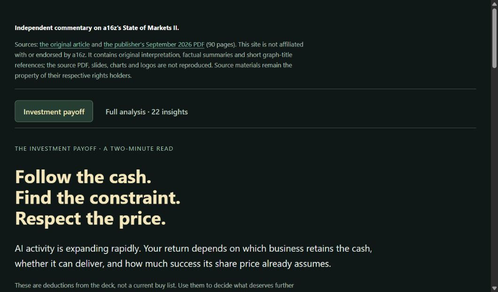

# State of Markets II — Investment Insights

[**Open the live interactive report**](https://az9713.github.io/state-of-market-ii-summary/)

Click the preview to open the working web page. GitHub README rendering does not execute an HTML application inline; GitHub Pages hosts the live report.

## What you get

- **Investment payoff:** three memorable questions, research directions and evidence that would change the conclusions.
- **Full analysis:** 22 cross-chart investment insights and two economic tensions, with corresponding PDF page numbers and graph titles.
- **Coverage:** a 90-page review ledger, with observations separated from inferences, forecasts and limitations.

The payoff is: **Who gets paid? What holds growth back? What am I paying for?**

## Sources and attribution

- **Article:** [State of Markets II, by David George — a16z](https://www.a16z.news/p/state-of-markets-ii).
- **PDF:** [State of Markets, September 2026 — publisher's download link](https://a16z.com/state-of-markets-report-2). The reviewed document is `State-of-Markets-Sep-2026.pdf`, 90 pages.
- **Direct publisher-hosted PDF:** [State-of-Markets-Sep-2026.pdf](https://d1lamhf6l6yk6d.cloudfront.net/uploads/2026/09/State-of-Markets-Sep-2026.pdf).

The article and PDF belong to their respective rights holders. This project is independent commentary and is not affiliated with or endorsed by Andreessen Horowitz or a16z. Exact graph titles are used as short source locators; the analysis and preview artwork are original to this project.

## Scope and limitations

The supplied PDF was reviewed in full, including chart images and footnotes. Quantitative observations retain the deck's dates and definitions; the underlying datasets were not all independently audited. Forecasts, correlations, accounting distinctions and source-label ambiguities are identified in the report. This is educational investment research, not a personalized recommendation or a current security valuation.

## Publication and privacy

Only the standalone report, this README, a live-page screenshot, original preview artwork and deployment control files are published. The source PDF, slide/chart images, source-page captures, local notes, extraction files, account information, workstation paths, credentials and session metadata are excluded. No analytics, tracking scripts or third-party fonts are loaded by the report.

## Copyright treatment

This repository publishes original critical synthesis and factual discussion, with short graph-title citations and links to the originals. It does not redistribute the PDF, source chart images, article text, source branding or logos. Source rights are retained by their owners; no license to those materials is granted here. The preview depicts this project's own decision framework, not an a16z chart.

## Run locally

Download `index.html` and open it in a browser. The two tabs, evidence links and page ledger work without a build or external dependencies. GitHub Pages serves `main` from the repository root.
